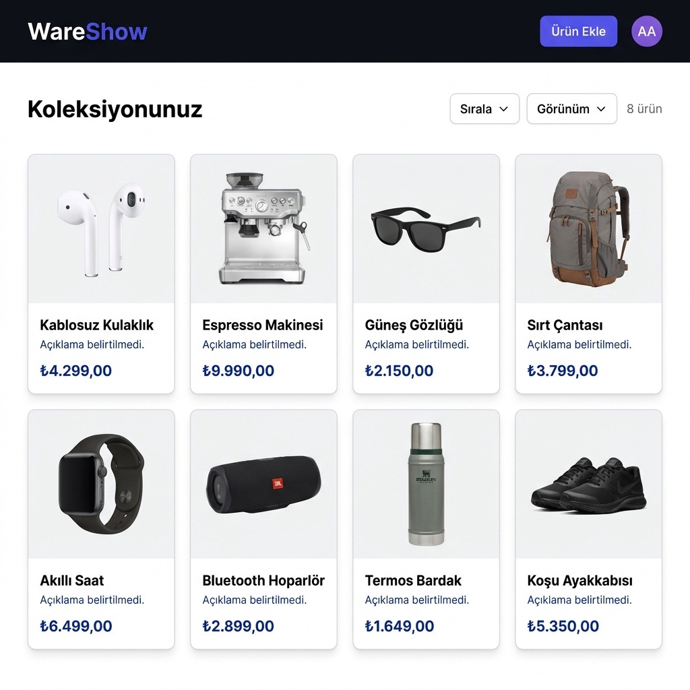

# WareShow - Akıllı Ürün Koleksiyonu ve Fiyat Takibi



Beğendiğiniz ürünleri tek bir panelde toplamanızı ve fiyat değişimlerini takip etmenizi sağlayan bir web uygulaması. Trendyol gibi popüler e-ticaret sitelerinden ürün linklerini ekleyerek güncel fiyat, başlık ve görsel bilgilerini otomatik olarak çekebilirsiniz.

## Özellikler
- **Hızlı Ürün Ekleme:** Sadece URL yapıştırarak ürün bilgilerini saniyeler içinde içeri aktarma.
- **Anlık Fiyat Takibi:** Ürün fiyatlarını manuel kontrol etme zahmetinden kurtulun.
- **Koleksiyon Yönetimi:** Ürünlerinizi düzenli bir şekilde listeleyin ve yönetin.
- **Modern Dashboard:** Temiz, kullanışlı ve duyarlı (responsive) arayüz.

## Kullanılan Teknolojiler
- **Arayüz:** HTML5, CSS3, JavaScript (Vanilla)
- **Backend:** Python, FastAPI, BeautifulSoup4, Requests
- **Veri Çekme:** Gelişmiş scraping algoritmaları ve JSON veri işleme.

## Kurulum

### 1. Backend Kurulumu
Backend tarafı Python ve FastAPI kullanmaktadır.

```bash
# Backend dizinine gidin
cd backend

# Gerekli kütüphaneleri yükleyin
pip install -r requirements.txt

# Sunucuyu başlatın
python -m uvicorn main:app --reload
```
*Varsayılan olarak http://localhost:8000 adresinde çalışacaktır.*

### 2. Frontend Kurulumu
Frontend dosyaları doğrudan tarayıcı üzerinden çalıştırılabilir. `index.html` dosyasını tarayıcınız ile açmanız yeterlidir.

## Geliştirme Notları
- Proje şu an için aktif olarak Trendyol üzerinden veri çekme testlerinden geçmiştir.
- Gelecekte diğer e-ticaret platformları için destek genişletilecek ve kullanıcı bazlı bildirim özellikleri eklenecektir.

---
*Bu bir kişisel geliştirme projesidir.*
